note: will add copyable commands later

download GHDL and GTKWave according to instructions on [dsd repo](https://github.com/kevinwlu/dsd/tree/master/ghdl)
```
$ git clone https://github.com/kevinwlu/dsd.git
$ mkdir vhdl
$ cd vhdl
$ cp ~/dsd/ghdl/*vhdl .
```
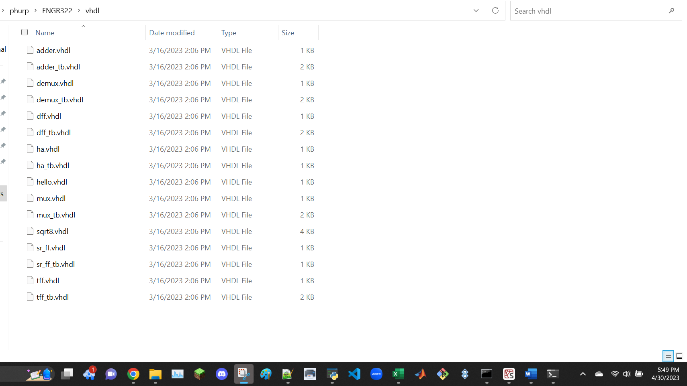

```
$ ghdl -h
$ ghdl -v
$ ghdl -a hello.vhdl
$ ghdl -e hello_world
$ ghdl -r hello_world
```
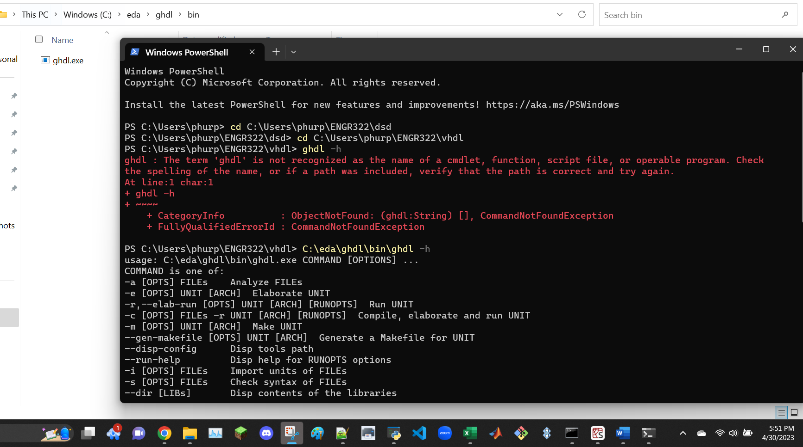
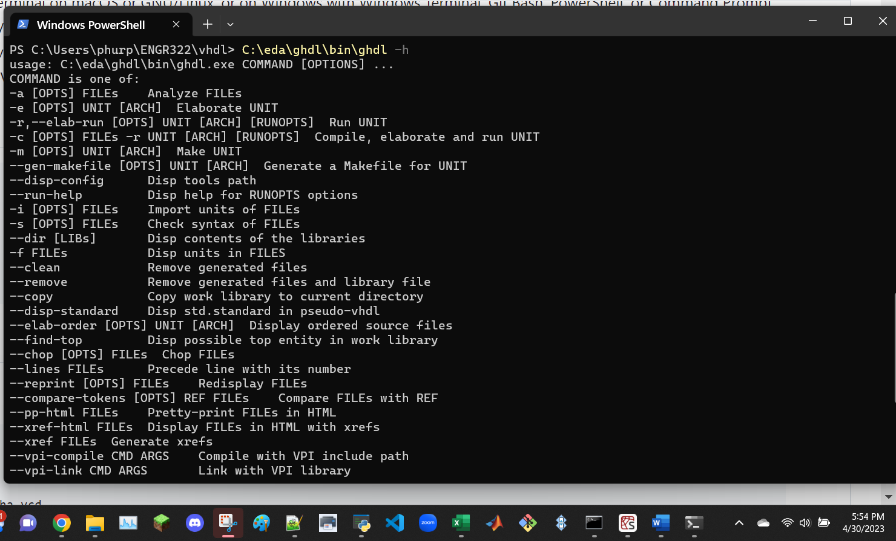
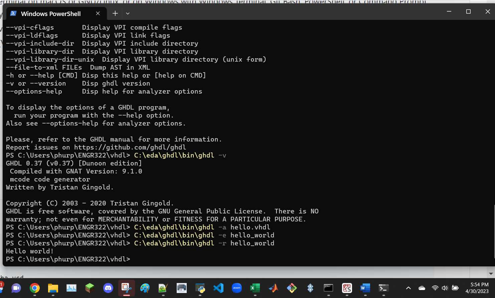

Half Adder
```
$ ghdl -a ha.vhdl
$ ghdl -a ha_tb.vhdl
$ ghdl -e ha_tb
$ ghdl -r ha_tb --vcd=ha.vcd
$ gtkwave ha.vcd
```
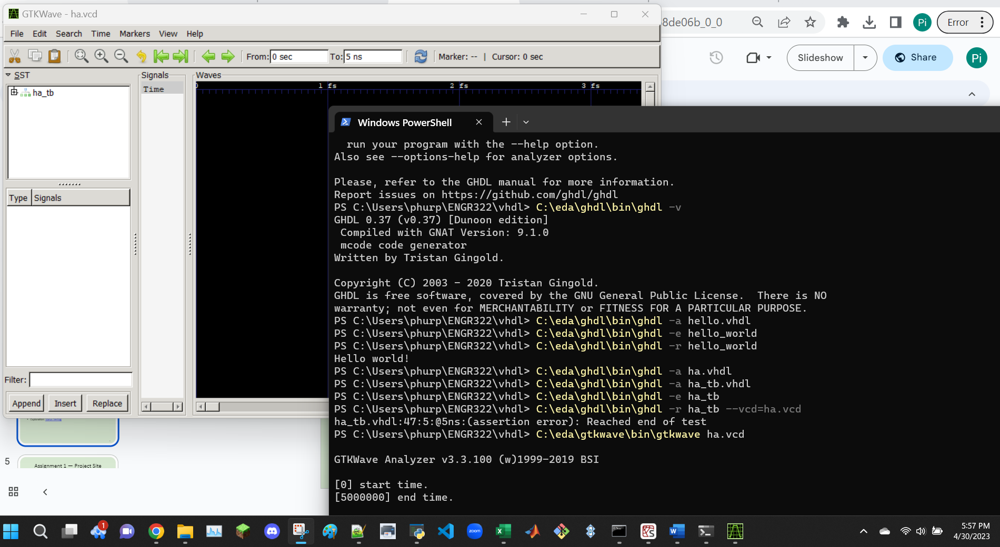

import the variables and resize the axis using magnifier
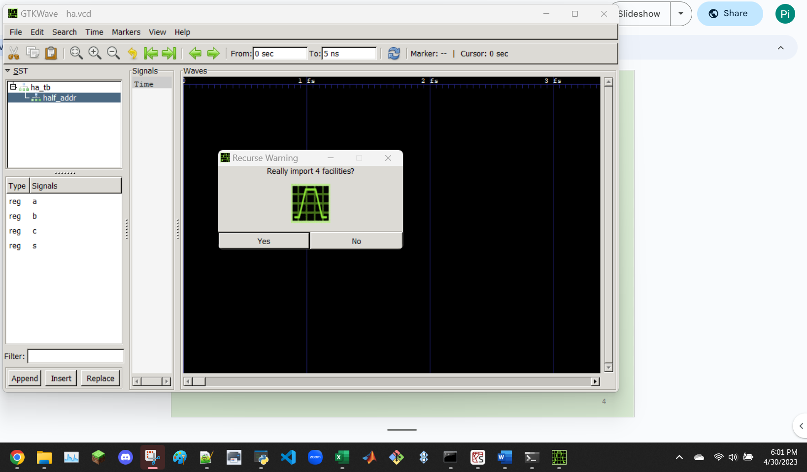
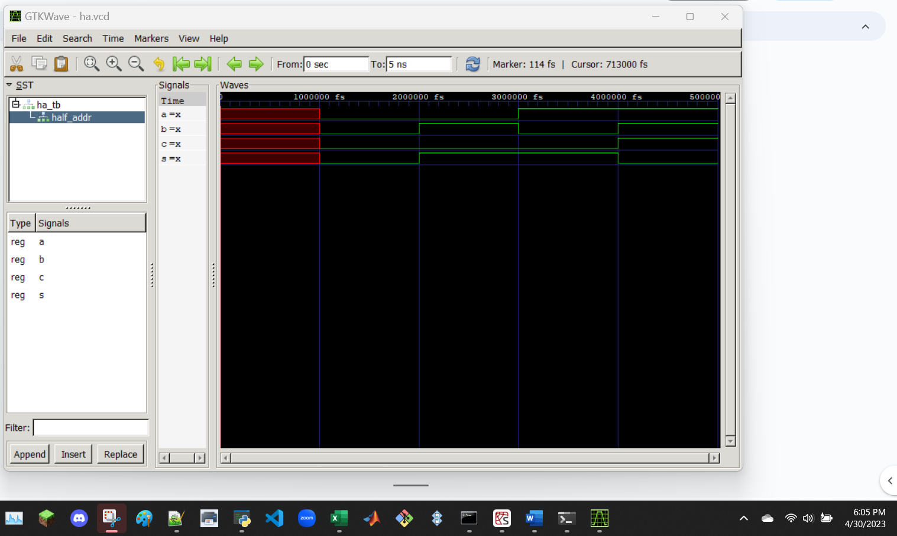

window closing logged in command line
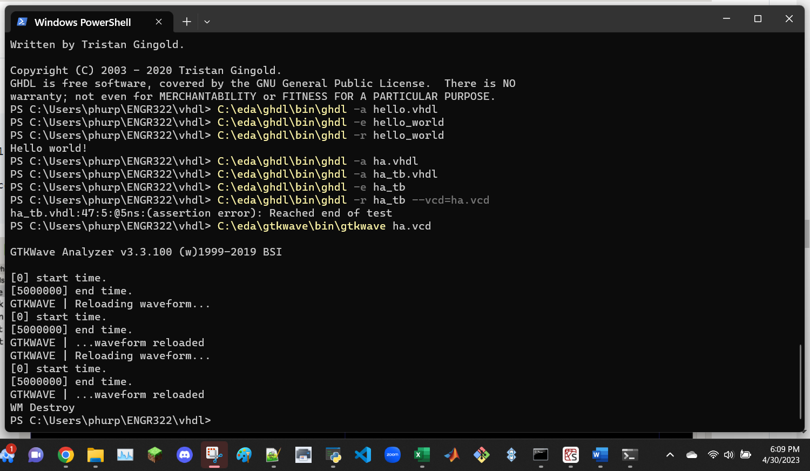

D Flip-Flop
```
$ ghdl -a dff.vhdl
$ ghdl -a dff_tb.vhdl
$ ghdl -e dff_tb
$ ghdl -r dff_tb --vcd=dff.vcd
$ gtkwave dff.vcd
```
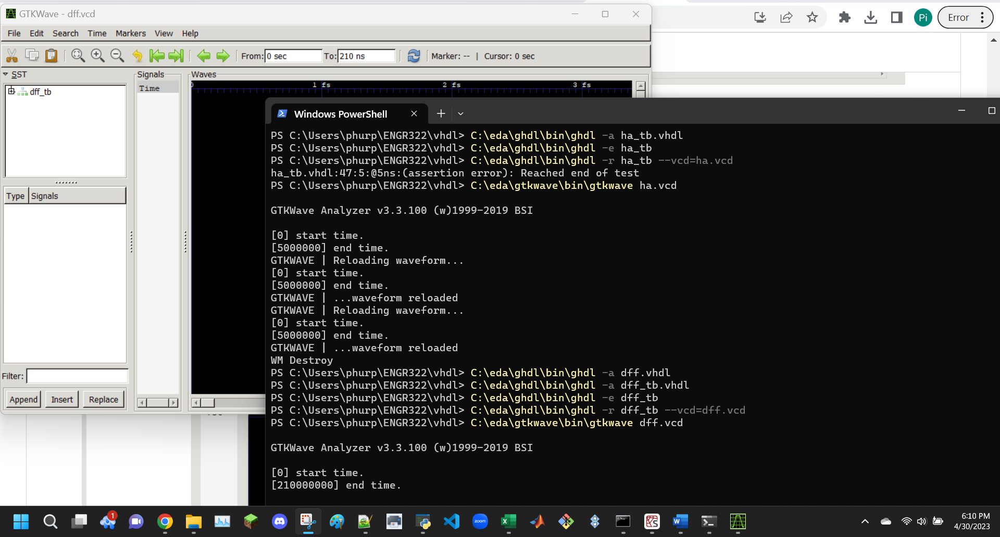

import the variables and resize the axis using magnifier
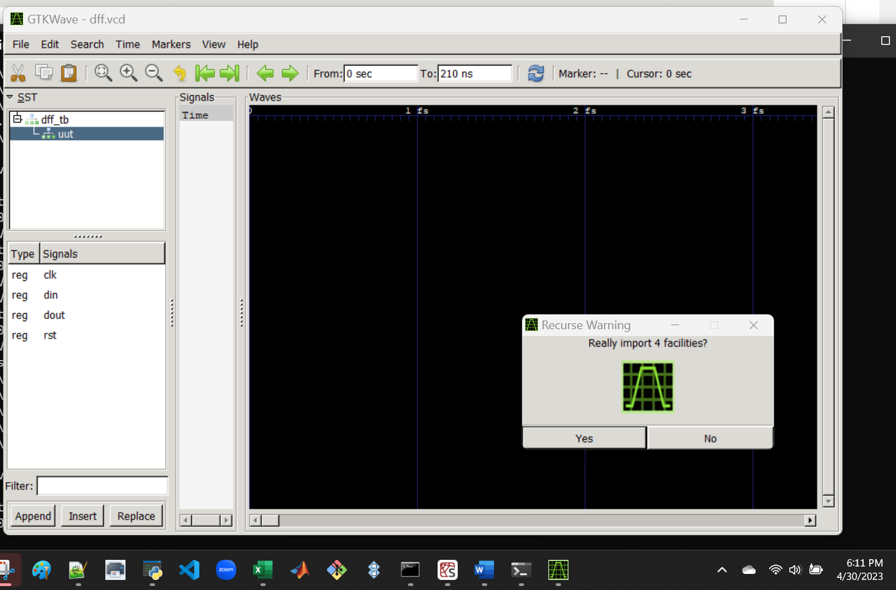
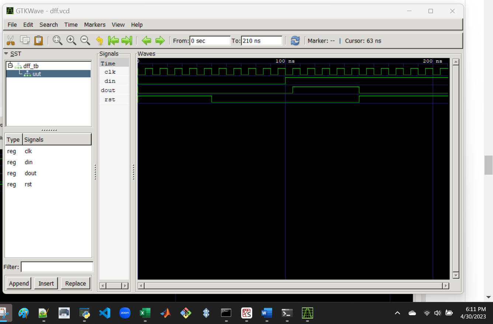

window closing logged in command line
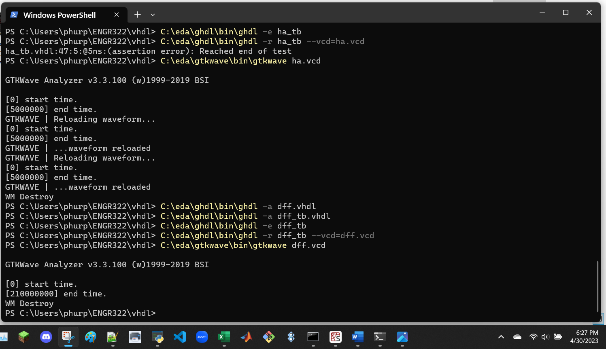
