```
$ hostname
$ env
```
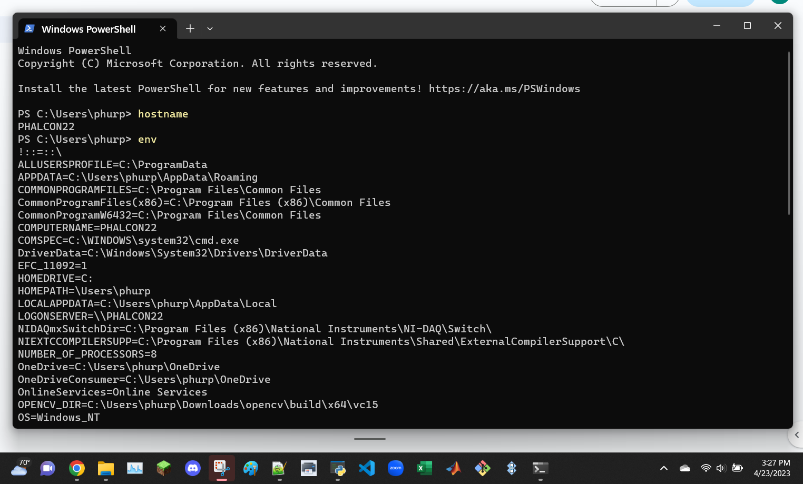

```
$ ps
```
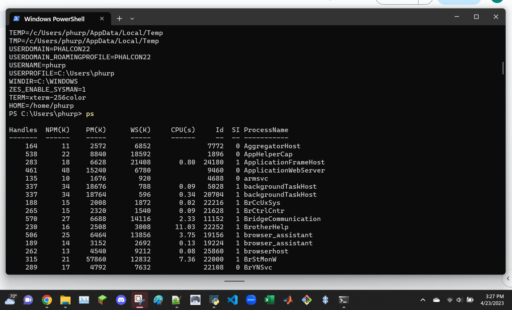

```
$ pwd
```
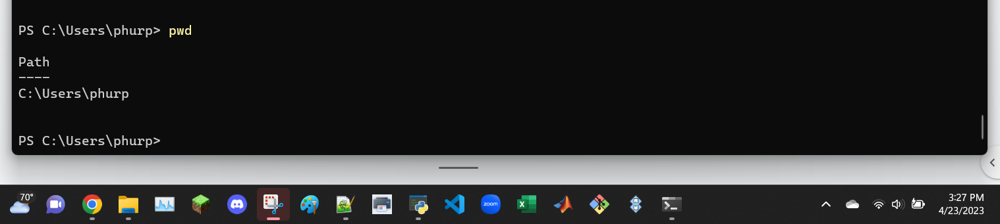

```
$ git clone https://github.com/kevinwlu/iot.git
```
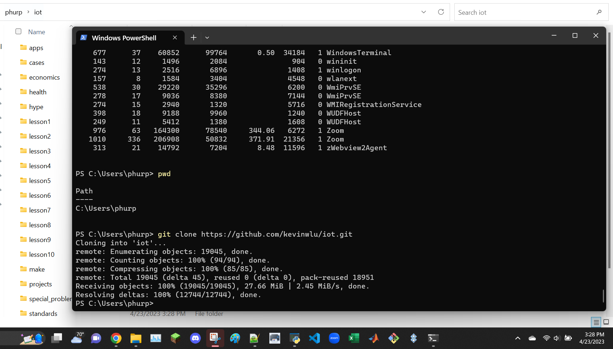

```
$ cd iot
$ ls
```


```
$ cd
$ df
$ mkdir demo
$ cd demo
```
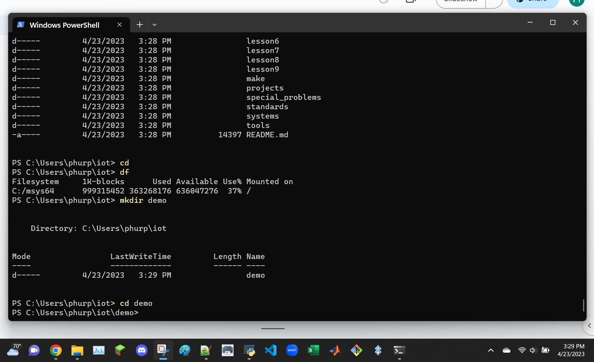

```
$ nano file
$ cat file
```

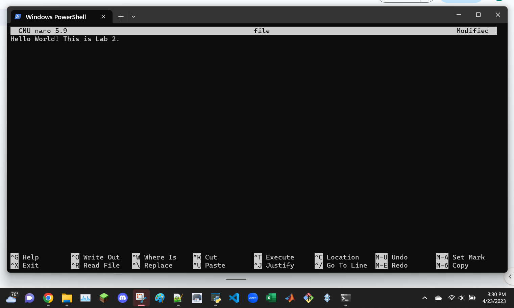
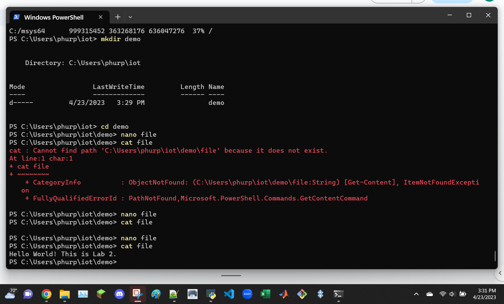

```
$ cp file file1
$ mv file file2
```
use ls to show the files are copied
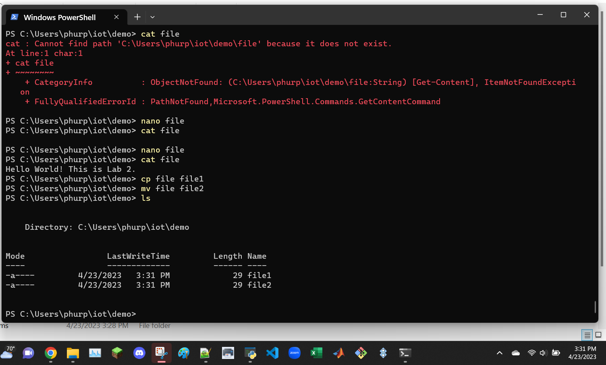

```
$ rm file2
```
use ls to show the file was removed
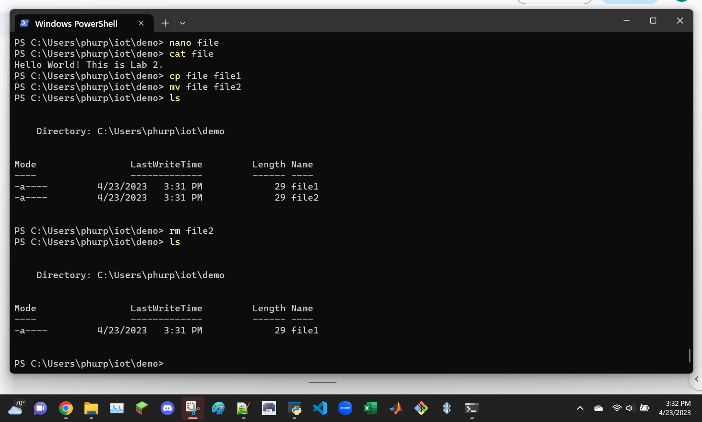

```
$ clear
```
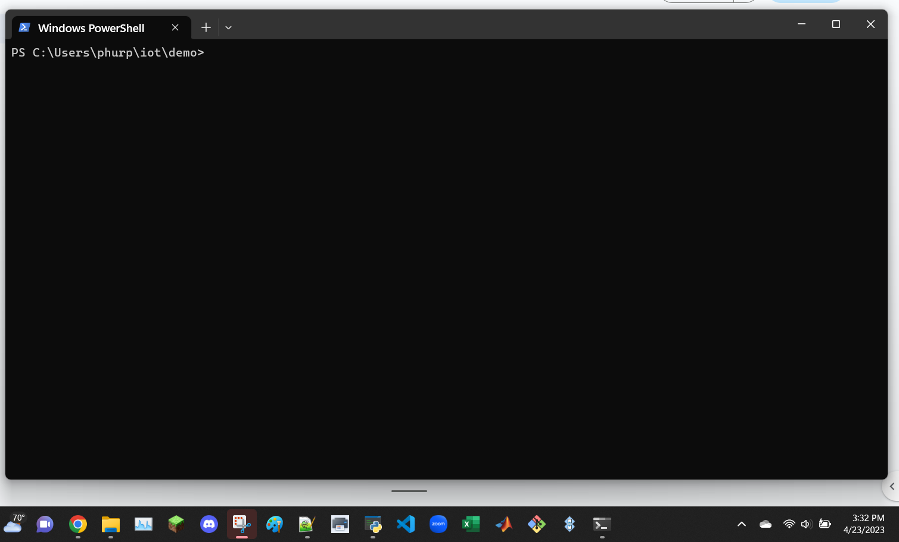

```
$ man uname
```
man uname command does not work on Windows PowerShell, test again later
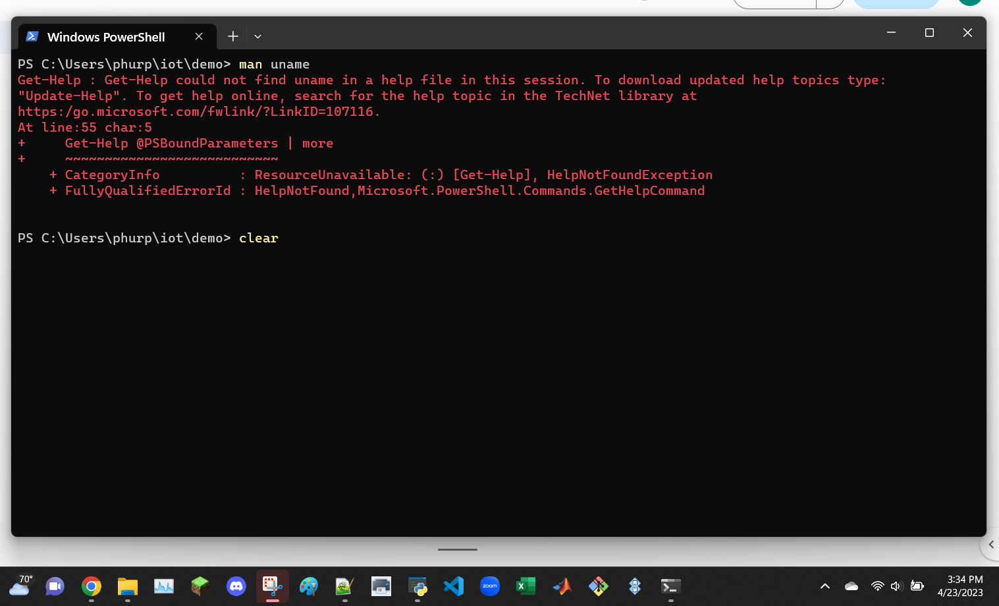

```
$ ifconfig
$ ping localhost
```

ifconfig command does not work on Windows PowerShell, test again later
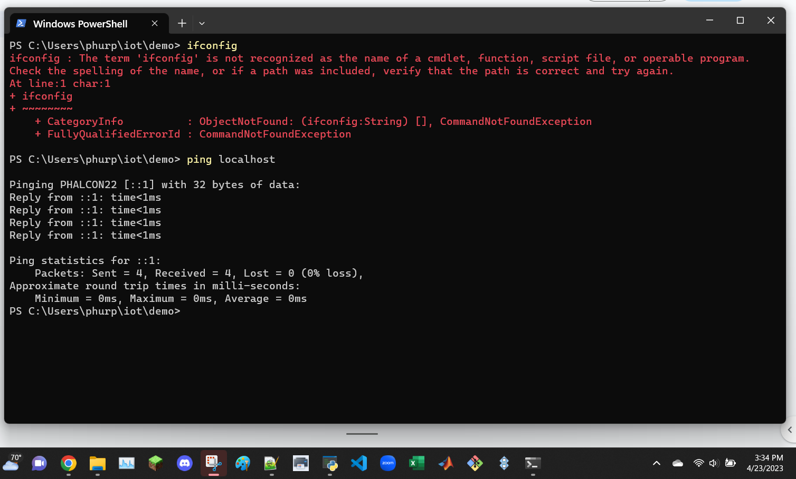

```
$ netstat
```
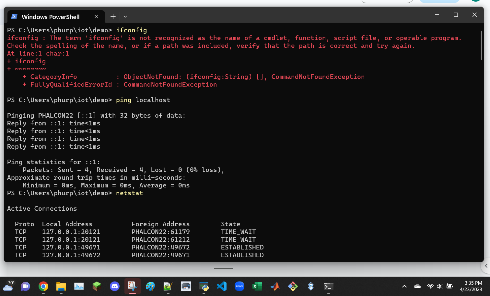

install ubuntu


```
$ man uname
$ uname -a
$ ifconfig
```
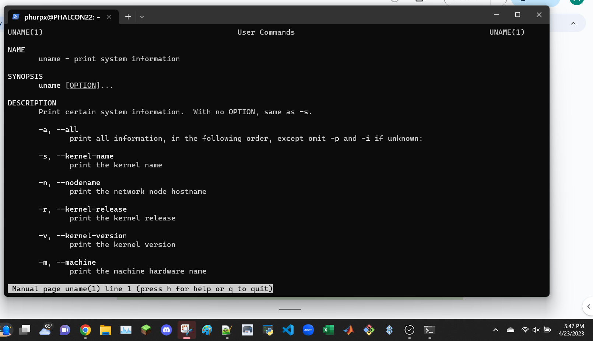
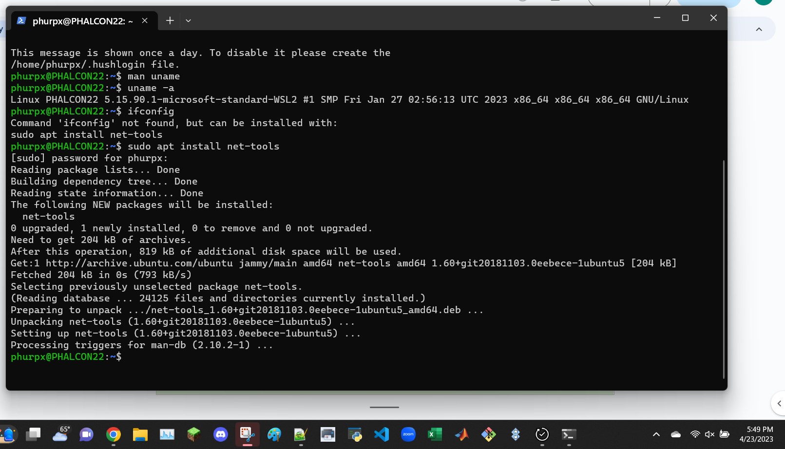
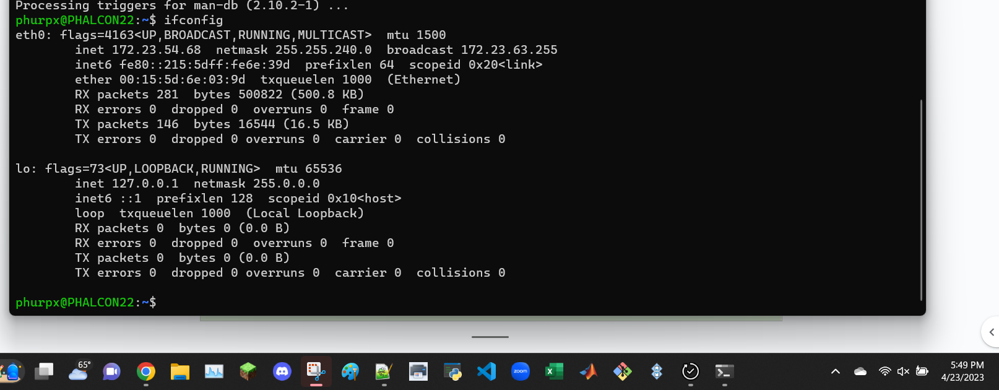
