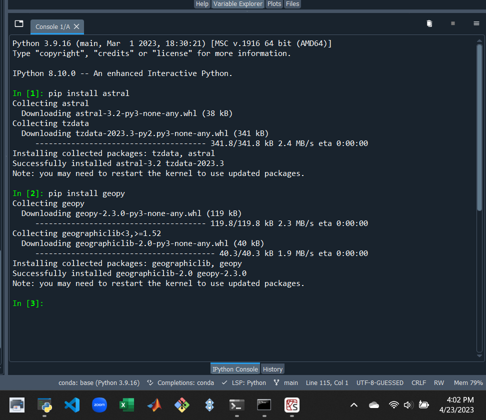
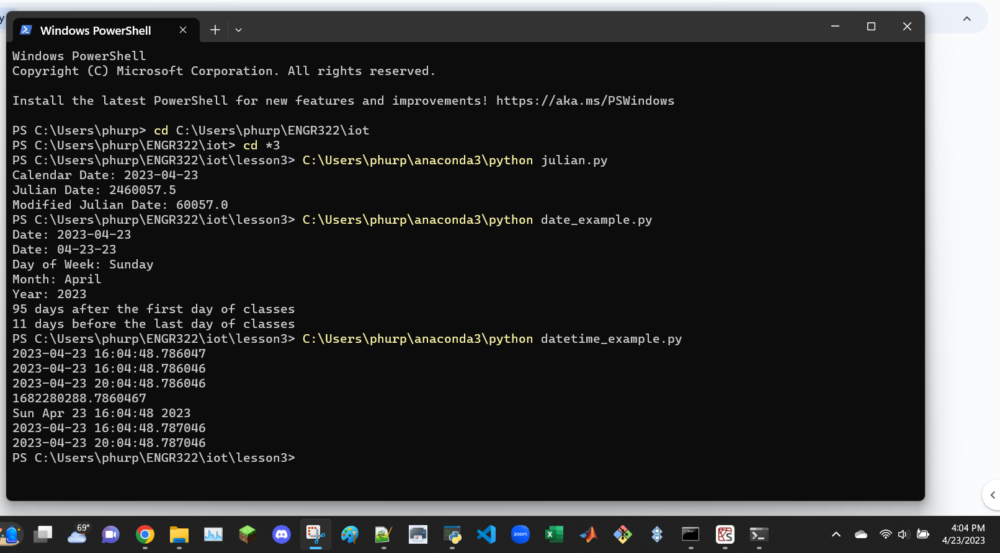
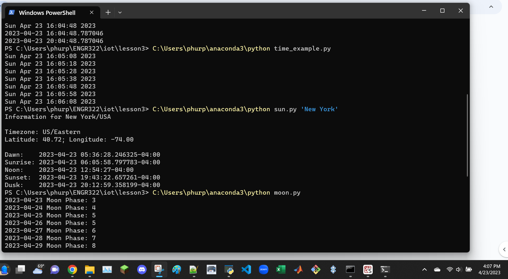

```
Install required Python packages such as jdcal, astral, and geopy
```
jdcal installed using Anaconda Navigator


```
$ cd ~/iot
$ cd *3
$ python3 julian.py
$ python3 date_example.py
$ python3 datetime_example.py
```


```
$ python3 time_example.py
$ python3 sun.py 'New York'
$ python3 moon.py
```



```
$ python3 coordinates.py 'SC Williams Library'
$ python3 address.py '40.74480675, -74.02532862031404'
$ python3 cpu.py
$ python3 battery.py
```


```
$ python3 documentstats.py document.txt
```

