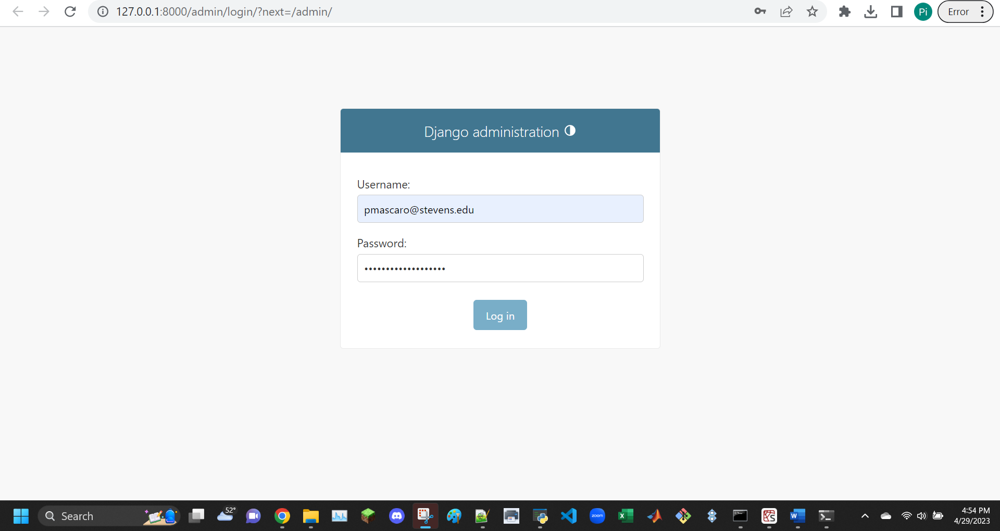

note: will add copyable commands later
'''
$ pip3 -V
$ pip3 list
$ sudo pip3 install -U setuptools
$ sudo pip3 install -U django
$ sudo pip3 install -U djangorestframework
$ sudo pip3 install -U django-filter
$ sudo pip3 install -U markdown
$ sudo pip3 install -U requests
'''


skip this: "2. Optional: Install MariaDB server and client on Raspberry Pi", move on to "3. Start Django project stevens"
```
pi@raspberrypi:~ $ django-admin startproject stevens
pi@raspberrypi:~ $ cd stevens
pi@raspberrypi:~/stevens $ ls
```
```
pi@raspberrypi:~/stevens $ python3 manage.py startapp myapp
pi@raspberrypi:~/stevens $ ls
```
```
pi@raspberrypi:~ $ sudo mysql -u root -p
```
remember "By default, Django uses SQLite"\
attempt using sqlite instead of mysql in previous command\
realize that the optional step 2 is, in fact, not optional


```
$ sudo apt update
$ sudo apt install mariadb-server mariadb-client
$ sudo apt install python3-mysqldb
$ sudo pip3 install -U mysqlclient
$ sudo mysql_secure_installation
Enter current password for root (enter for none): 
Change the root password? [Y/n] 
New password: PASSWORD
Re-enter new password: PASSWORD
Remove anonymous users? [Y/n] 
Disallow root login remotely? [Y/n] 
Remove test database and access to it? [Y/n] 
Reload privilege tables now? [Y/n]
```


```
pi@raspberrypi:~ $ sudo mysql -u root -p
Enter password: PASSWORD
MariaDB [(none)]> use mysql
MariaDB [mysql]> select user, host from mysql.user;
MariaDB [mysql]> create user pi@localhost identified by 'PASSWORD';
MariaDB [mysql]> show databases;
MariaDB [mysql]> create database stevens;
MariaDB [mysql]> grant all privileges on stevens.* to pi@localhost;
MariaDB [mysql]> quit
```


```
pi@raspberrypi:~/stevens $ cd stevens
pi@raspberrypi:~/stevens/stevens $ ls
pi@raspberrypi:~/stevens/stevens $ nano settings.py
```
```
Follow ~/iot/lesson4/stevens/settings.txt, e.g., add an asterisk to ALLOWED_HOSTS and 'myapp' to INSTALLED_APPS
The comma after 'myapp' is required
Remember to change PASSWORD for MySQL user pi
```


```
pi@raspberrypi:~/stevens/stevens $ cp ~/iot/lesson4/stevens/urls.py .
pi@raspberrypi:~/stevens/stevens $ cd ..
```
```
pi@raspberrypi:~/stevens $ cd myapp
pi@raspberrypi:~/stevens/myapp $ ls
pi@raspberrypi:~/stevens/myapp $ cp ~/iot/lesson4/stevens/admin.py .
pi@raspberrypi:~/stevens/myapp $ cp ~/iot/lesson4/stevens/models.py .
pi@raspberrypi:~/stevens/myapp $ cp ~/iot/lesson4/stevens/views.py .
```
```
pi@raspberrypi:~/stevens/myapp $ mkdir static templates
pi@raspberrypi:~/stevens/myapp $ cd templates
pi@raspberrypi:~/stevens/myapp/templates $ mkdir myapp
pi@raspberrypi:~/stevens/myapp/templates $ cd myapp
pi@raspberrypi:~/stevens/myapp/templates/myapp $ cp ~/iot/lesson4/stevens/index.html .
```


ghghgh





TROUBLESHOOTING STARTS HERE


