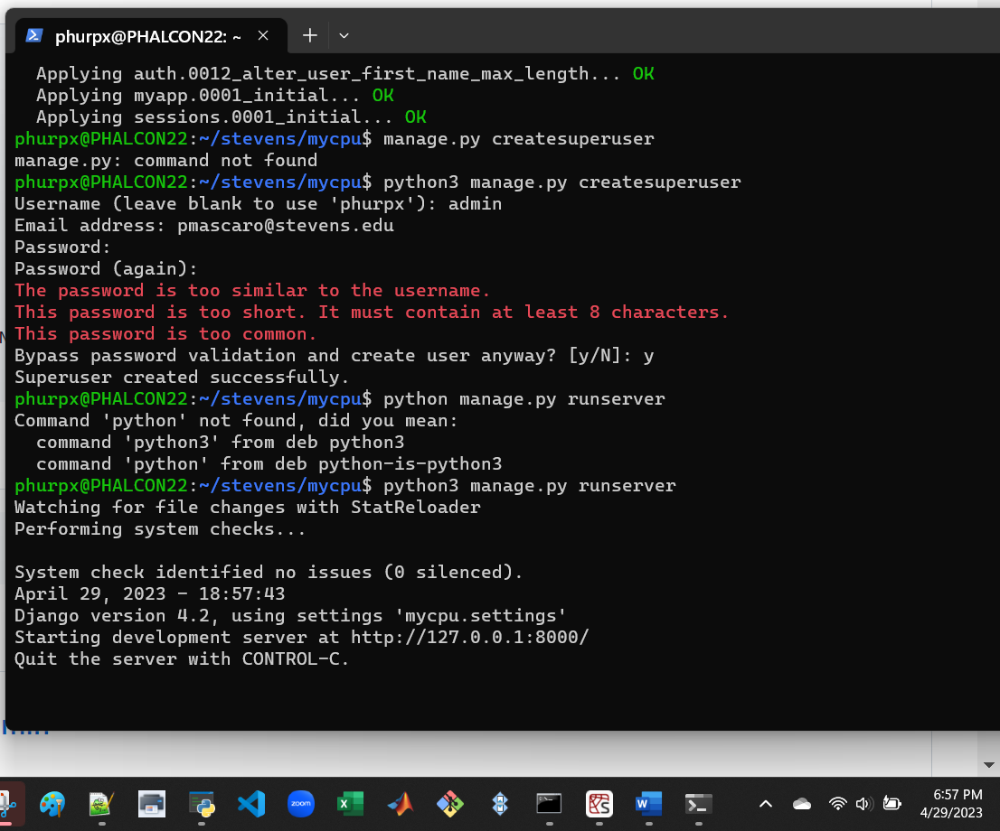
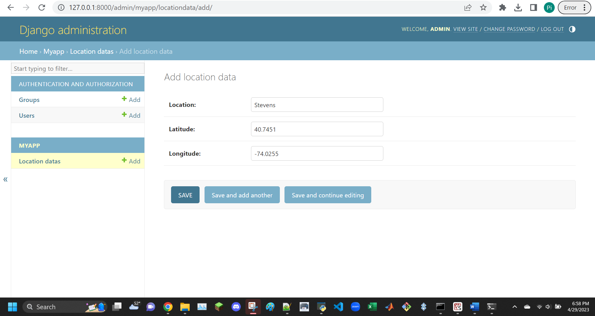

```
$ pip3 -V
$ pip3 list
$ sudo pip3 install -U setuptools
$ sudo pip3 install -U django
$ sudo pip3 install -U djangorestframework
$ sudo pip3 install -U django-filter
$ sudo pip3 install -U markdown
$ sudo pip3 install -U requests
```


skip this: "2. Optional: Install MariaDB server and client on Raspberry Pi", move on to "3. Start Django project stevens"
```
pi@raspberrypi:~ $ django-admin startproject stevens
pi@raspberrypi:~ $ cd stevens
pi@raspberrypi:~/stevens $ ls
```
```
pi@raspberrypi:~/stevens $ python3 manage.py startapp myapp
pi@raspberrypi:~/stevens $ ls
```
```
pi@raspberrypi:~ $ sudo mysql -u root -p
```
remember "By default, Django uses SQLite"\
attempt using sqlite instead of mysql in previous command\
realize that the optional step 2 is, in fact, not optional


```
$ sudo apt update
$ sudo apt install mariadb-server mariadb-client
$ sudo apt install python3-mysqldb
$ sudo pip3 install -U mysqlclient
$ sudo mysql_secure_installation
Enter current password for root (enter for none): 
Change the root password? [Y/n] 
New password: PASSWORD
Re-enter new password: PASSWORD
Remove anonymous users? [Y/n] 
Disallow root login remotely? [Y/n] 
Remove test database and access to it? [Y/n] 
Reload privilege tables now? [Y/n]
```


```
pi@raspberrypi:~ $ sudo mysql -u root -p
Enter password: PASSWORD
MariaDB [(none)]> use mysql
MariaDB [mysql]> select user, host from mysql.user;
MariaDB [mysql]> create user pi@localhost identified by 'PASSWORD';
MariaDB [mysql]> show databases;
MariaDB [mysql]> create database stevens;
MariaDB [mysql]> grant all privileges on stevens.* to pi@localhost;
MariaDB [mysql]> quit
```


```
pi@raspberrypi:~/stevens $ cd stevens
pi@raspberrypi:~/stevens/stevens $ ls
pi@raspberrypi:~/stevens/stevens $ nano settings.py
```
```
Follow ~/iot/lesson4/stevens/settings.txt, e.g., add an asterisk to ALLOWED_HOSTS and 'myapp' to INSTALLED_APPS
The comma after 'myapp' is required
Remember to change PASSWORD for MySQL user pi
```


```
pi@raspberrypi:~/stevens/stevens $ cp ~/iot/lesson4/stevens/urls.py .
pi@raspberrypi:~/stevens/stevens $ cd ..
```
```
pi@raspberrypi:~/stevens $ cd myapp
pi@raspberrypi:~/stevens/myapp $ ls
pi@raspberrypi:~/stevens/myapp $ cp ~/iot/lesson4/stevens/admin.py .
pi@raspberrypi:~/stevens/myapp $ cp ~/iot/lesson4/stevens/models.py .
pi@raspberrypi:~/stevens/myapp $ cp ~/iot/lesson4/stevens/views.py .
```
```
pi@raspberrypi:~/stevens/myapp $ mkdir static templates
pi@raspberrypi:~/stevens/myapp $ cd templates
pi@raspberrypi:~/stevens/myapp/templates $ mkdir myapp
pi@raspberrypi:~/stevens/myapp/templates $ cd myapp
pi@raspberrypi:~/stevens/myapp/templates/myapp $ cp ~/iot/lesson4/stevens/index.html .
```


```
Enable Google Maps API
Application programming interface (API)
https://cloud.google.com/maps-platform
https://developers.google.com/maps/documentation/javascript/get-api-key
https://churchthemes.com/page-didnt-load-google-maps-correctly
```
api is pay-to-use :(\
this is what you would do if you are willing to pay:
```
pi@raspberrypi:~/stevens/myapp/templates/myapp $ nano index.html
<script src="https://maps.googleapis.com/maps/api/js?key=YOUR_API_KEY"></script>
```


```
pi@raspberrypi:~/stevens/myapp/templates/myapp $ cd ~/stevens/myapp/static
pi@raspberrypi:~/stevens/myapp/static $ cp ~/iot/lesson4/static/favicon.ico .
pi@raspberrypi:~/stevens/myapp/static $ mkdir myapp
pi@raspberrypi:~/stevens/myapp/static $ cd myapp
pi@raspberrypi:~/stevens/myapp/static/myapp $ cp ~/iot/lesson4/static/*css .
pi@raspberrypi:~/stevens/myapp/static/myapp $ cp ~/iot/lesson4/static/*js .
pi@raspberrypi:~/stevens/myapp/static/myapp $ cd ~/stevens
```


```
pi@raspberrypi:~/stevens $ python3 manage.py makemigrations myapp
pi@raspberrypi:~/stevens $ python3 manage.py migrate
pi@raspberrypi:~/stevens $ python3 manage.py createsuperuser
Username (leave blank to use 'pi'):
Email address: EMAIL_ADDRESS
Password: PASSWORD
Password (again): PASSWORD
Superuser created successfully.
```


```
pi@raspberrypi:~/stevens $ python3 manage.py runserver
```


```
Go to http://127.0.0.1:8000/admin
Login with Django administration username (pi) and password
Click temperature data to add
Date and time in YYYY-MM-DD HH:MM:SS

Temperature in Fahrenheit

Latitude 40.7451

Longitude -74.0255

Click SAVE
View app at http://127.0.0.1:8000
```


NOTE: FROM THIS POINT DOWN I CREATED THE FOLDER IN THE WRONG SPOT BECAUSE I DIDN'T REALIZE I WAS SUPPOSED TO BE IN THE ROOT FOLDER\
this causes errors which I was able to eventually fix, but I will show the entire process
```
~ $ django-admin startproject mycpu
~ $ cd mycpu
~/mycpu $ ls
```
```
~/mycpu $ python manage.py startapp myapp
~/mycpu $ ls
```


```
~/mycpu $ cd mycpu
~/mycpu/mycpu $ ls
~/mycpu/mycpu $ nano settings.py
```
```
Follow ~/iot/lesson4/mycpu/settings.txt, e.g., add an asterisk to ALLOWED_HOSTS and 'myapp' and 'rest_framework' to INSTALLED_APPS
The comma after 'rest_framework' is required
```
```
~/mycpu/mycpu $ cp ~/iot/lesson4/mycpu/urls.py .
~/mycpu/mycpu $ cd ..
```


```
~/mycpu $ cd myapp
~/mycpu/myapp $ ls
~/mycpu/myapp $ cp ~/iot/lesson4/mycpu/admin.py .
~/mycpu/myapp $ cp ~/iot/lesson4/mycpu/models.py .
~/mycpu/myapp $ cp ~/iot/lesson4/mycpu/views.py .
~/mycpu/myapp $ cp ~/iot/lesson4/mycpu/serializers.py .
```


```
~/mycpu/myapp $ nano views.py
```


```
~/mycpu/myapp $ mkdir static templates
~/mycpu/myapp $ cd templates
~/mycpu/myapp/templates $ mkdir myapp
~/mycpu/myapp/templates $ cd myapp
~/mycpu/myapp/templates/myapp $ cp ~/iot/lesson4/mycpu/index.html .
```


```
~/mycpu/myapp/templates/myapp $ nano index.html
```
again, the api is paid, but this is how you would edit it


```
~/mycpu/myapp/templates/myapp $ cd ~/mycpu/myapp/static
~/mycpu/myapp/static $ cp ~/iot/lesson4/static/favicon.ico .
~/mycpu/myapp/static $ mkdir myapp
~/mycpu/myapp/static $ cd myapp
~/mycpu/myapp/static/myapp $ cp ~/iot/lesson4/static/*css .
~/mycpu/myapp/static/myapp $ cp ~/iot/lesson4/static/*js .
~/mycpu/myapp/static/myapp $ cd ~/mycpu
```
```
Stevens favicon: ~/iot/lesson4/static/favicon.ico
Xidian favicon: ~/iot/lesson4/static/xidian/favicon.ico
```


```
~/mycpu $ ls
~/mycpu $ cp ~/iot/lesson4/mycpu/controller.py .
```
```
~/mycpu $ nano controller.py
```
```
~/mycpu $ sudo pip install -U psutil
```


```
~/mycpu $ python manage.py makemigrations myapp
~/mycpu $ python manage.py migrate
~/mycpu $ python manage.py createsuperuser
Username (leave blank to use '_'): admin
Email address: EMAIL_ADDRESS
Password: admin
Password (again): admin
The password is too similar to the username.
This password is too short. It must contain at least 8 characters.
This password is too common.
Bypass password validation and create user anyway? [y/N]: y
Superuser created successfully.
```


```
~/mycpu $ python manage.py runserver
```



```
At the first time, go to http://127.0.0.1:8000/admin
Login with Django administration username (admin) and password (admin)
Click location data to add one of the following
Location Stevens
Latitude 40.7451
Longitude -74.0255
Location Xidian
Latitude 34.12250
Longitude 108.84029
Click SAVE
```



```
Post the following in HTML form:
2022 to the Dt List at http://127.0.0.1:8000/dt
20 to the Cpu List at http://127.0.0.1:8000/cpu
20 to the Mem List at http://127.0.0.1:8000/mem
```
did 2023


```
~/mycpu $ python controller.py
```
using another window because the server is running in the first window


```
View app at http://127.0.0.1:8000/home
```
from this point down there are errors that I fix later, but I want to show the issues I encountered
for some reason the website wasnt loading properly


attempted using 2022 as per instructions, didn't work


checking the error logs, change the year in the file from 2021 to 2023


change the year back to 2023 from 2022


because it was not working, attempted this suggested command:
```
Alternatively, run Django server at 0.0.0.0:8000
~/mycpu $ python manage.py runserver 0.0.0.0:8000
```

because it was still not working, I decided to move on and troubleshoot it at a later time\
from this point until the troubleshooting section there are no errors

```
$ cd ~/iot/lesson4
python3 hello_world.py
```
```
Run Flask server and open a browser via VNC Viewer and go to http://127.0.0.1:5000/
```


TROUBLESHOOTING STARTS HERE\
after consulting the professor, the issues we discussed are that the passwords didn't match, and the folder was not in the right location\
change the passwords, attempt to run the code without it working


move the folder, attempt to run the code without it working


realize the server needs to be running in one terminal and then the code can be run in a different terminal


program now runs properly!!
