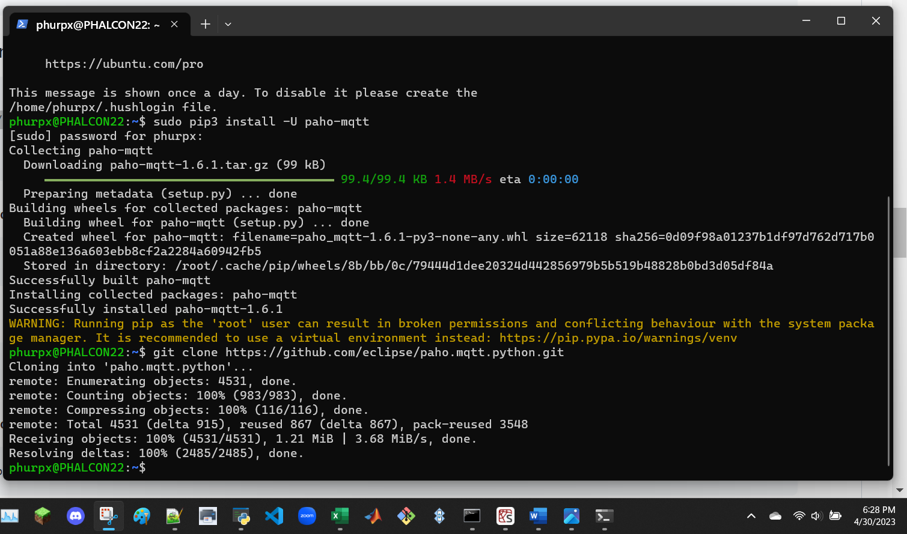
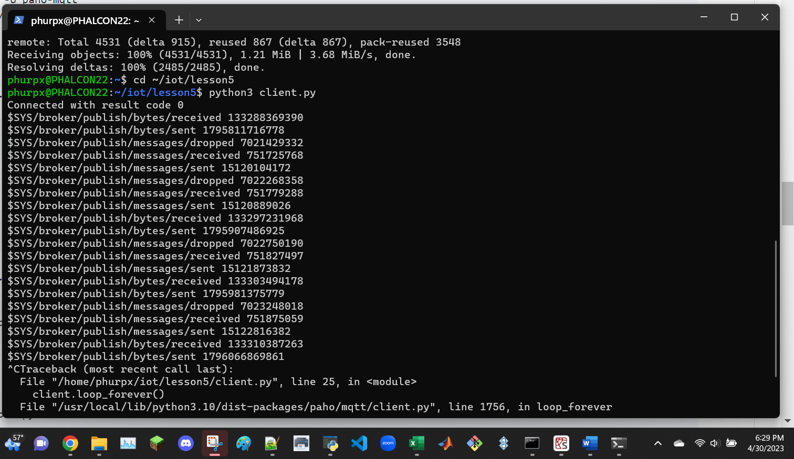
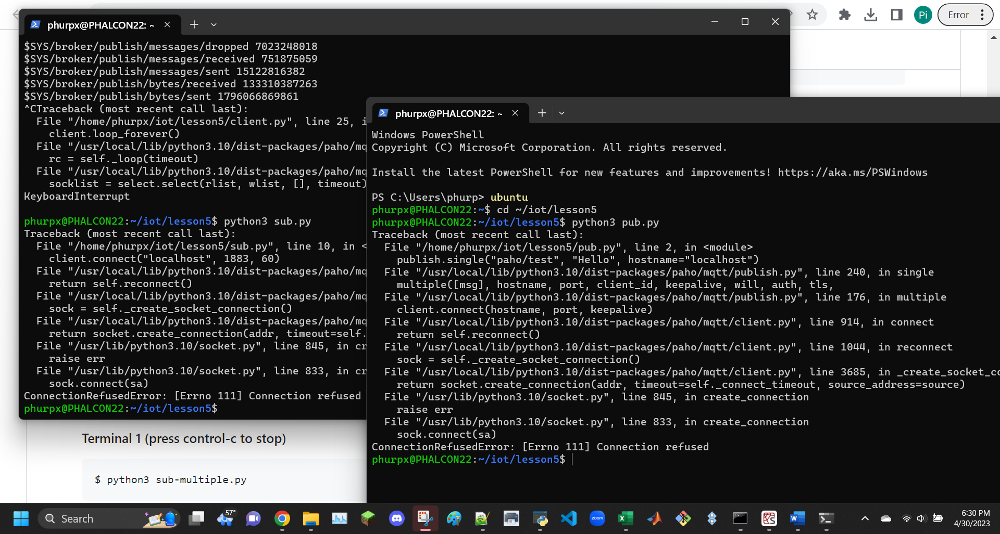
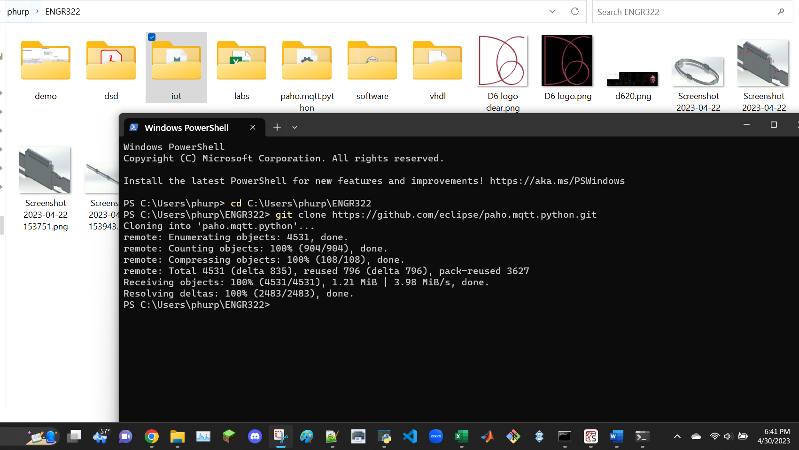

download and install Mosquitto

```
$ sudo pip3 install -U paho-mqtt
$ git clone https://github.com/eclipse/paho.mqtt.python.git
$ cd ~/iot/lesson5
$ python3 client.py
```



use two terminals, one for each command
```
$ python3 sub.py
$ python3 pub.py
```



at this point I thought it wasn't working because I downloaded Mosquitto on Windows but downloaded Paho on Ubuntu, so I redid the above steps in Windows



at this point I realized that I only needed to run subcpu.py and pubcpu.py

use two terminals, one for each command
```
$ python3 subcpu.py
$ python3 pubcpu.py
```


