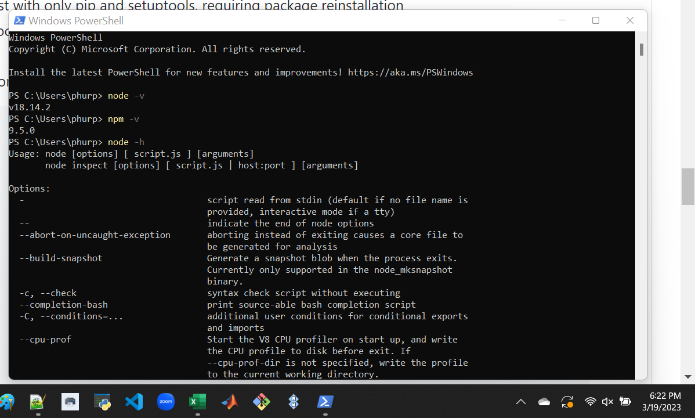
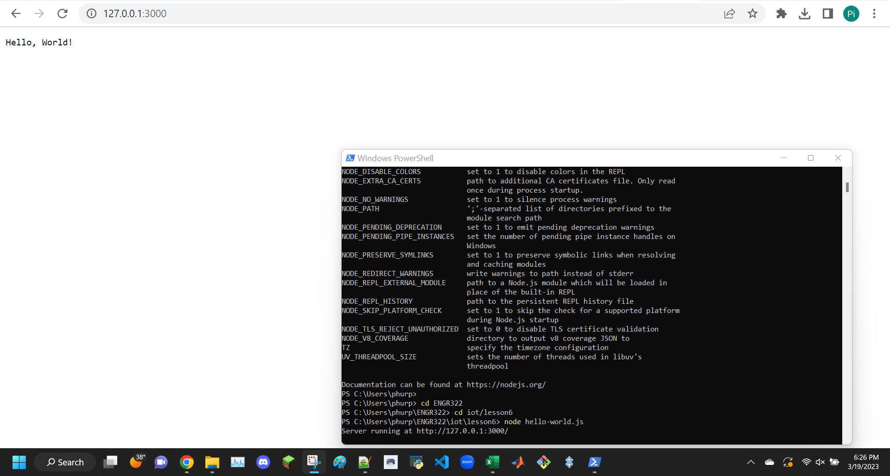
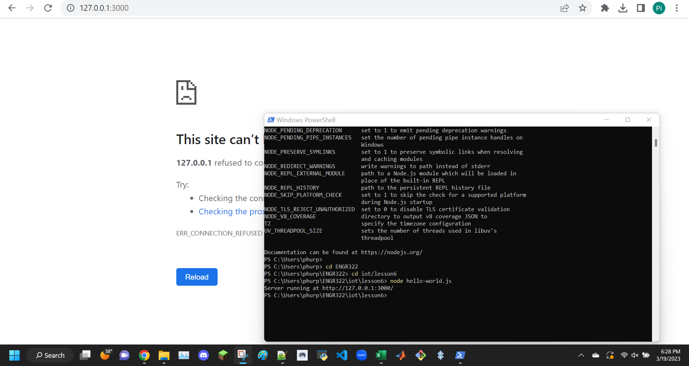
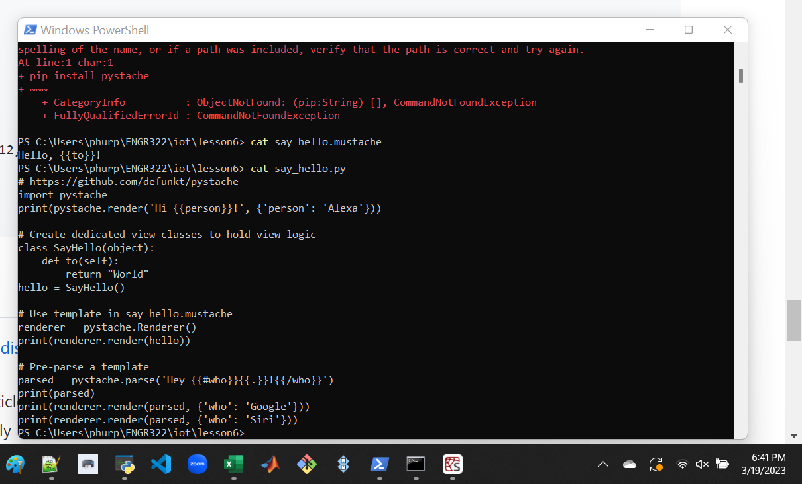
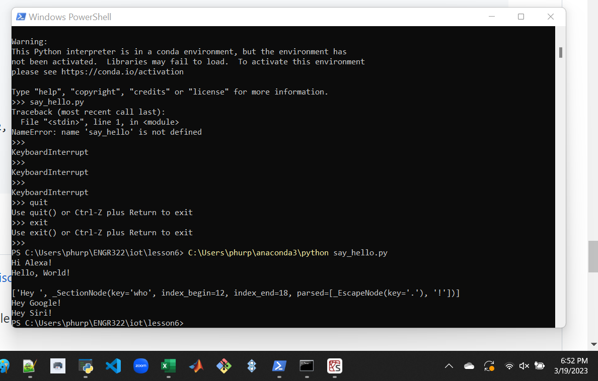

```
$ node -v
$ npm -v
$ node -h
```


```
$ cd ~/iot/lesson6
$ node hello-world.js
```


```
ctrl + c
```


```
$ node hello.js
```
having trouble accessing the webpage


code works on localhost


```
$ node http.js
```


```
$ sudo pip3 install pystache
```


```
$ cd ~/iot/lesson6
$ cat say_hello.mustache
$ cat say_hello.py
```


```
$ python3 say_hello.py
```

