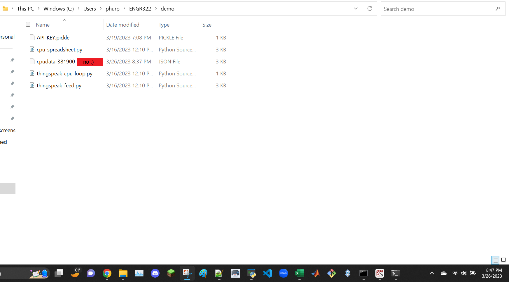
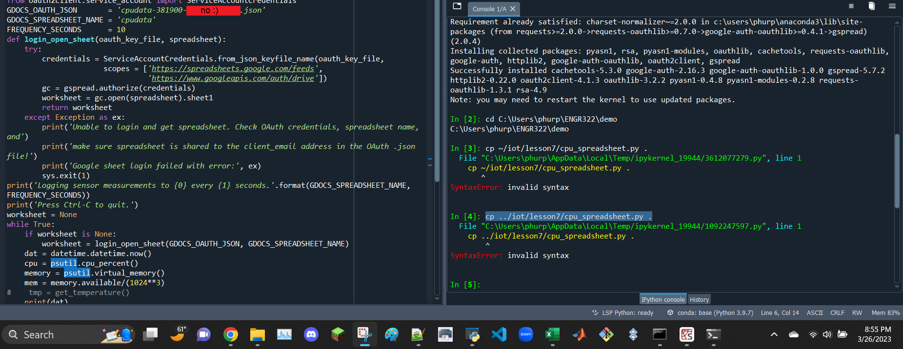
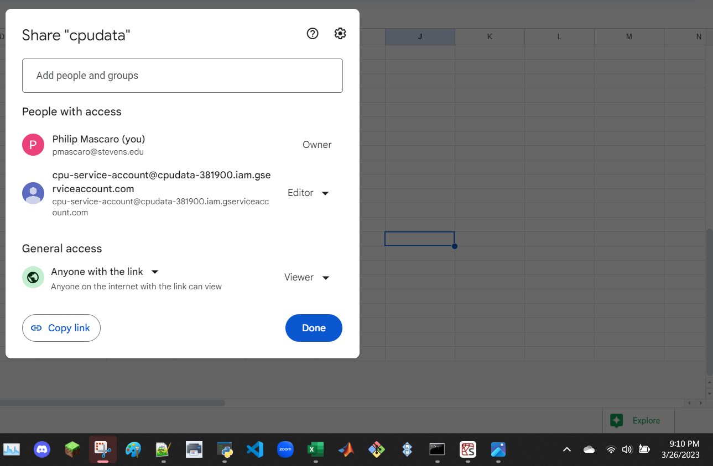

```
Sign up and log in ThingSpeak
Create new channel cpu_loop with field1 cpu_pc and field2 mem_avail_mb
Copy the Write API Key from channels
```


```
$ sudo pip3 install -U psutil
```


```
$ cd ~/demo
$ cp ~/iot/lesson7/thingspeak_cpu_loop.py .
$ cp ~/iot/lesson7/thingspeak_feed.py .
```


```
$ cat thingspeak_cpu_loop.py
```


```
$ cat thingspeak_feed.py
```


```
$ python3 thingspeak_feed.py
An API key savefile was not found. Enter Write API Key >>>
Should we save this key for future use? [y/N] >>>
```
API key is hidden


data collected


data collected again


```
Click "Create" and enter the project name, e.g., rpidata
```
did cpudata


```
≡ > APIs & Services > + Enable APIs & Services > Enable both Drive API and Sheets API
```


```
Credential > Create Credentials > Create service account key > Service account > rpidata > JSON key type > Create > download rpidata-xxxxxxxxxxxx.json
```

key hidden


```
$ sudo pip3 install -U gspread oauth2client
```


```
$ cd demo
$ cp ~/iot/lesson3/system_info.py .
$ cp ~/iot/lesson7/rpi_spreadsheet.py .
```
did not need system_info.py because I am doing a cpudata project


files properly copied to demo folder, key hidden


```
Start a new spreadsheet rpidata (or cpudata)
```


```
Share the spreadsheet with the "client_email" address in the .json file, select “Can edit,” and click "Send"
```


```
Delete Rows 2 to 1000, and enter Date / Time, CPU Usage %, Temperature C (or Memory Available GB for cpudata) to header cells
```


```
Edit rpi_spreadsheet.py
```
edited cpu_spreadsheet.py, key hidden


```
$ python3 rpi_spreadsheet.py
```


data properly collecting


[spreadsheet can be viewed by anyone with the link](https://docs.google.com/spreadsheets/d/1HkHynE6UBCzZVbJZs3Eoyt9ftPxSCAv70VdLFH6KNss/edit?usp=sharing)

