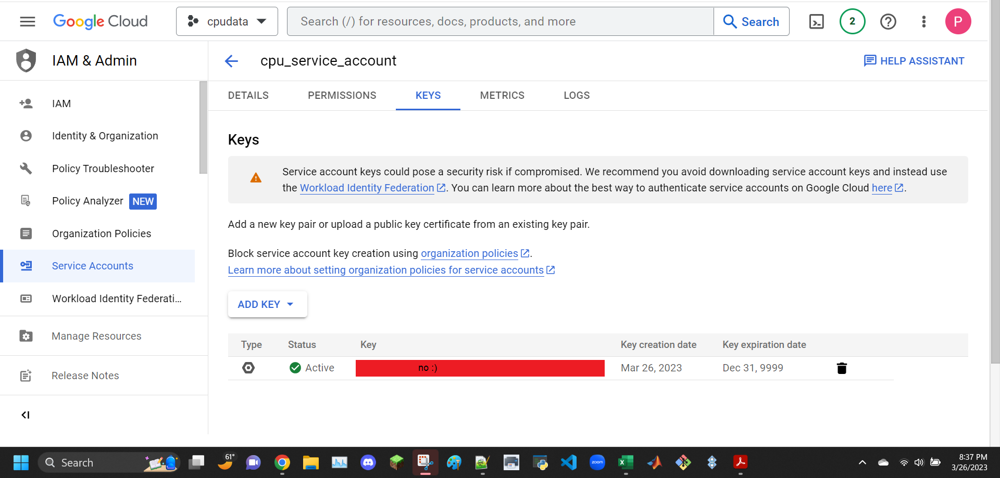

```
Sign up and log in ThingSpeak
Create new channel cpu_loop with field1 cpu_pc and field2 mem_avail_mb
Copy the Write API Key from channels
```


```
$ sudo pip3 install -U psutil
```


```
$ cd ~/demo
$ cp ~/iot/lesson7/thingspeak_cpu_loop.py .
$ cp ~/iot/lesson7/thingspeak_feed.py .
```


```
$ cat thingspeak_cpu_loop.py
```


```
$ cat thingspeak_feed.py
```


```
$ python3 thingspeak_feed.py
An API key savefile was not found. Enter Write API Key >>>
Should we save this key for future use? [y/N] >>>
```


data collected


data collected again


```
Click "Create" and enter the project name, e.g., rpidata
```
did cpudata


```
≡ > APIs & Services > + Enable APIs & Services > Enable both Drive API and Sheets API
```


```
Credential > Create Credentials > Create service account key > Service account > rpidata > JSON key type > Create > download rpidata-xxxxxxxxxxxx.json
```



```
$ sudo pip3 install -U gspread oauth2client
```


ghghgh


