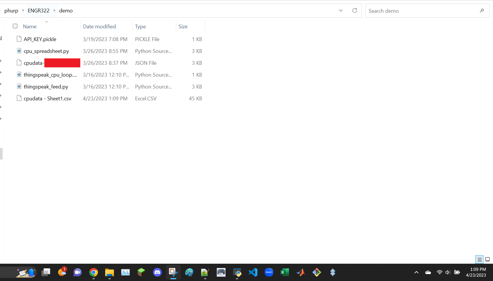
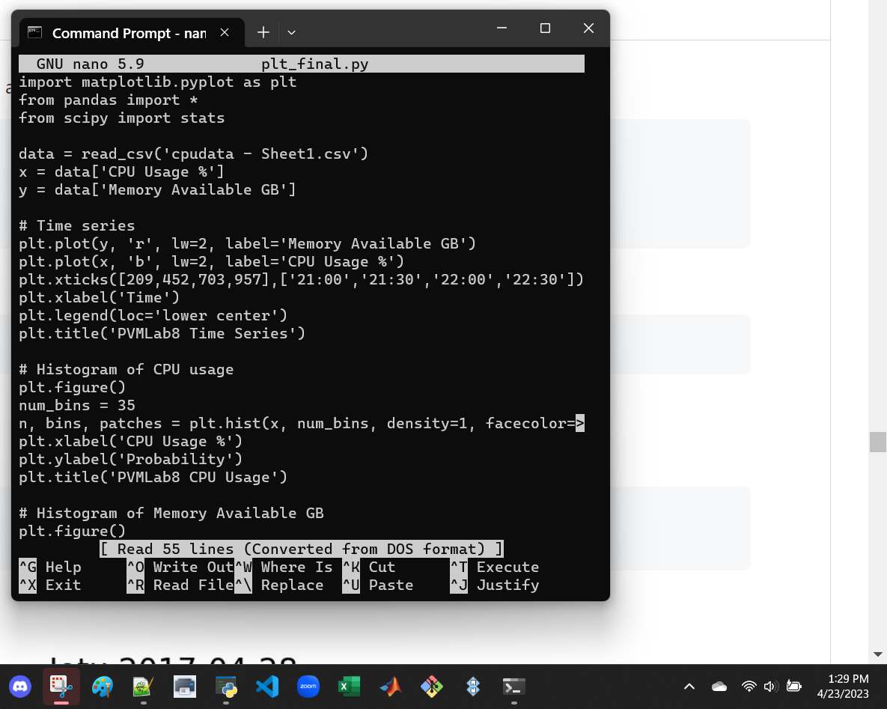
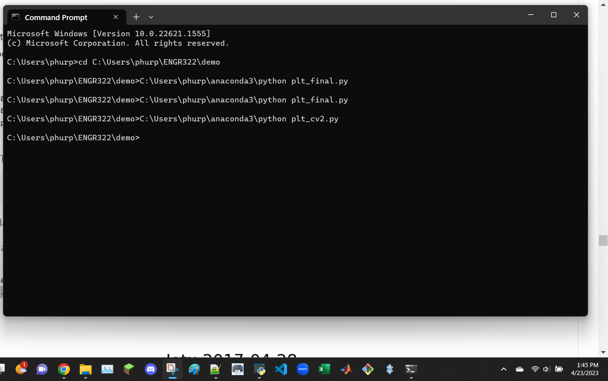
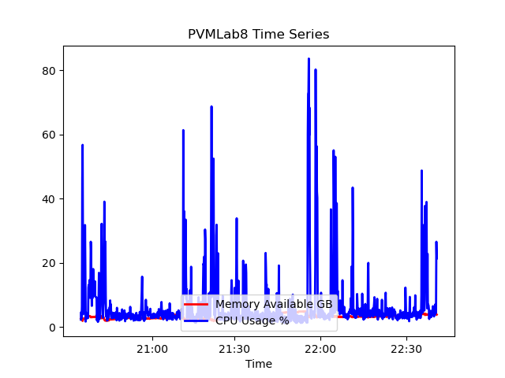
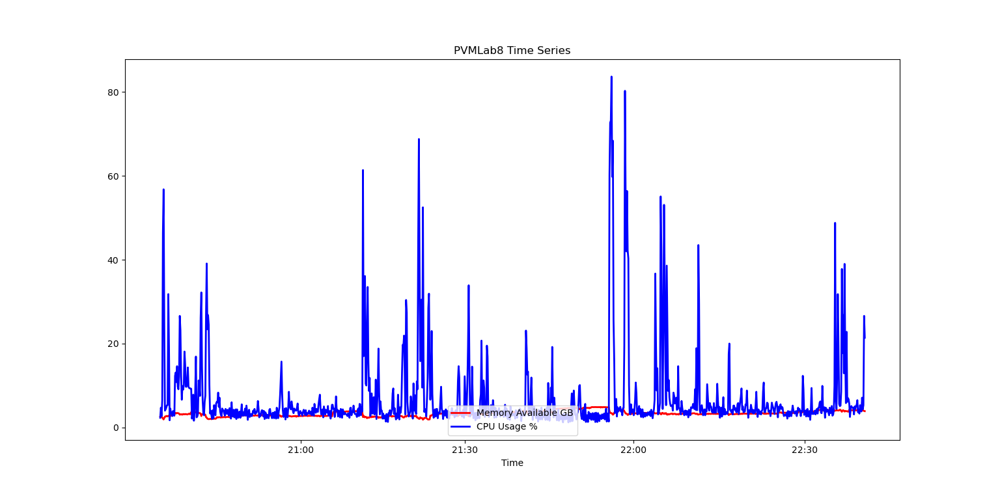
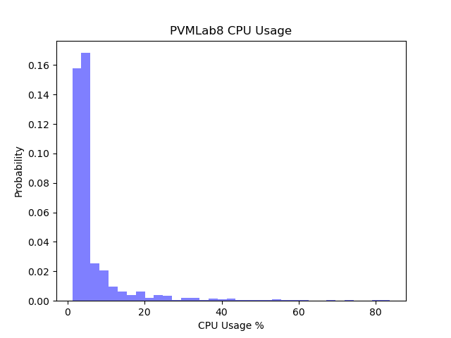
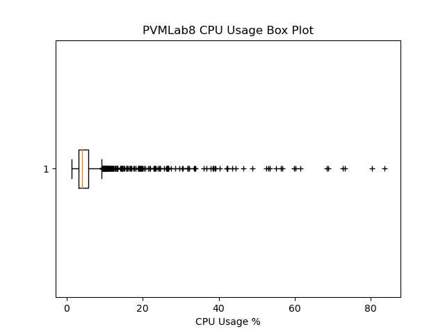
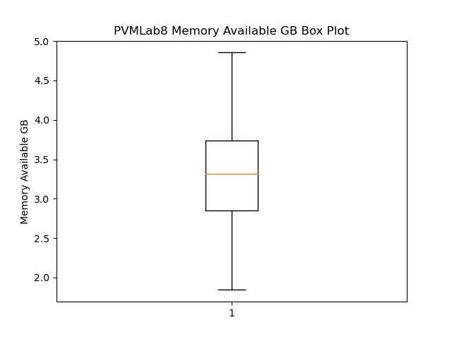
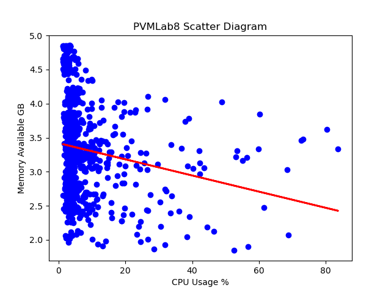
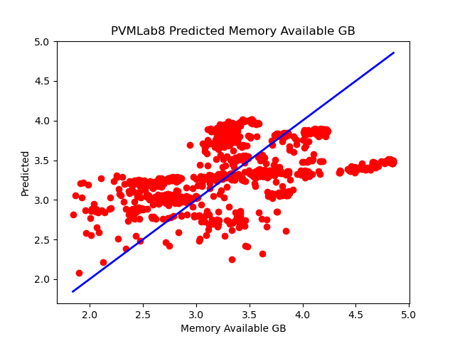

```
$ sudo pip3 install numpy scipy scikit-learn matplotlib pandas tensorflow keras
```
installations done using Anaconda Navigator


```
$ cd ~/demo
$ cp ~/iot/lesson8/plt_final.py .
$ cp ~/iot/lesson8/plt_cv2.py .
```
before command

after command


```
$ nano plt_final.py
$ nano plt_cv2.py
```
update the data series and the chart titles\
1. plt_final.py:
   - data = read_csv('cpudata - Sheet1.csv')
2. plt_cv2.py:
   - X = read_csv('cpudata - Sheet1.csv', usecols=[1])
   - y = read_csv('cpudata - Sheet1.csv', usecols=[2])





```
$ python3 plt_final.py
$ python3 plt_cv2.py
```


Figure 1\
cannot see Memory Available GB series well\


Figure 1 larger\
can now see Memory Available GB series well\


Figure 2


Figure 3


Figure 4


Figure 5


Figure 6


Figure 7

