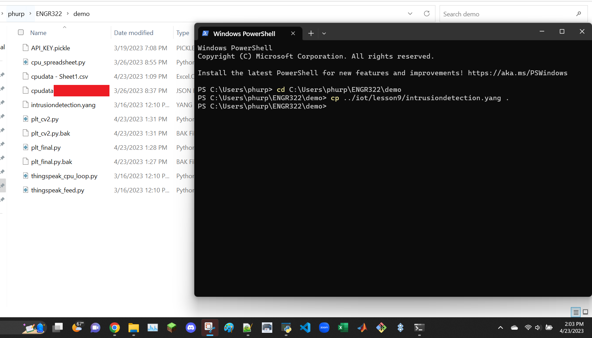
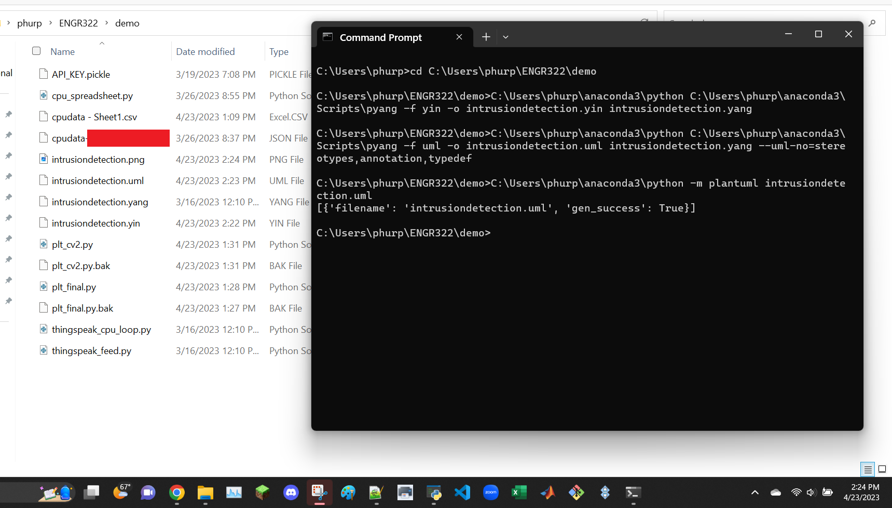
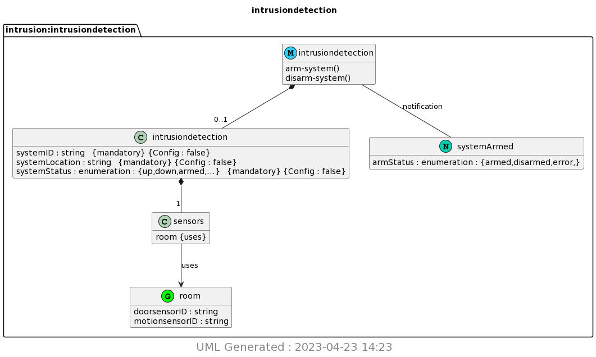

```
$ sudo pip3 install pyang plantuml
$ mkdir ~/demo
$ cp ~/iot/lesson9/intrusiondetection.yang ~/demo
$ cd ~/demo
```
installations done using Anaconda Navigator\
demo folder previously existed


```
$ cat intrusiondetection.yang
$ pyang -f yin -o intrusiondetection.yin intrusiondetection.yang
$ cat intrusiondetection.yin
$ pyang -f uml -o intrusiondetection.uml intrusiondetection.yang --uml-no=stereotypes,annotation,typedef
$ cat intrusiondetection.uml
$ python3 -m plantuml intrusiondetection.uml
```
cat instructions not required to perform


output image

