note: will add copyable commands later
```
$ cd ~/iot/lesson10
$ cat hash_value.py
$ python3 hash_value.py
$ python3 hash_value.py
```
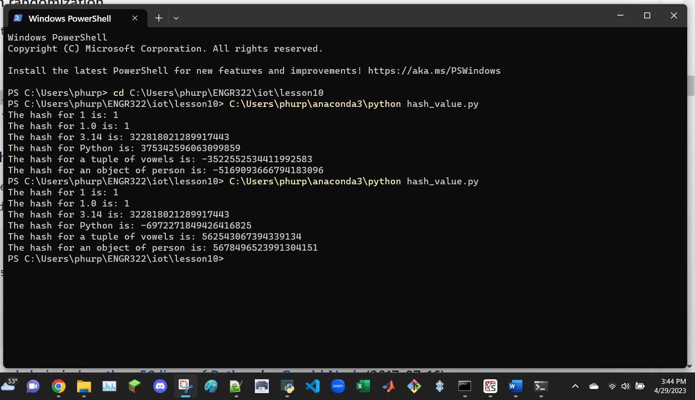

```
$ cd ~/iot/lesson10
$ cat snakecoin.py
$ python3 snakecoin.py
```
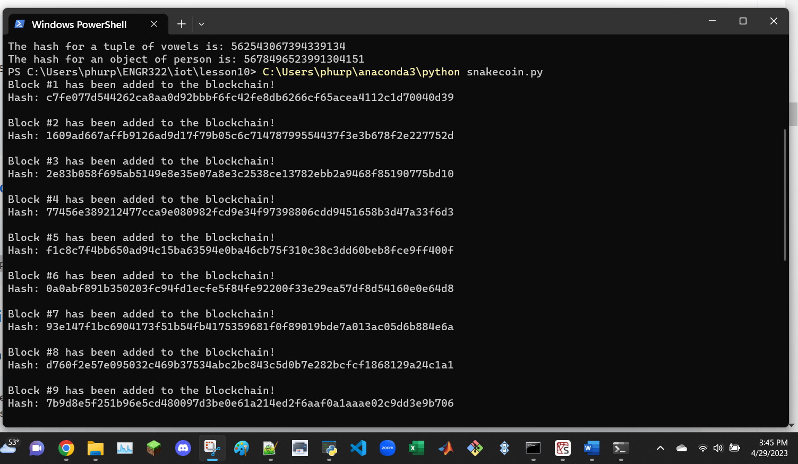

```
$ cat snakecoin-server-full-code.py
$ python3 snakecoin-server-full-code.py
$ cd
```
note: the final cd command will bring the user to the home directory
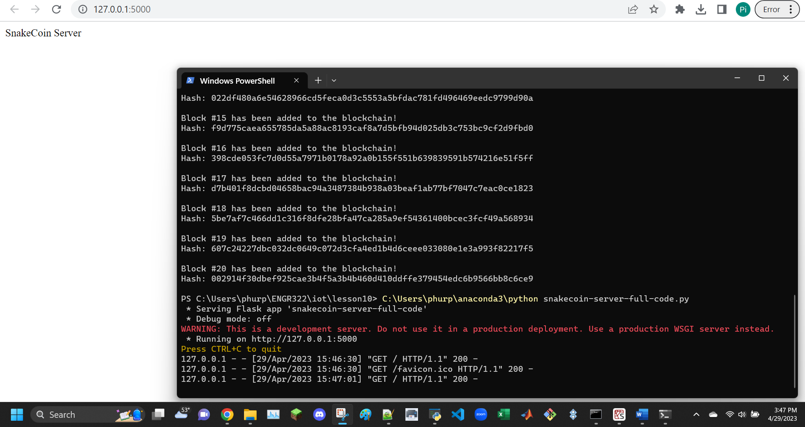

```
$ curl "localhost:5000/txion" \
     -H "Content-Type: application/json" \
     -d '{"from": "akjflw", "to":"fjlakdj", "amount": 3}'
$ curl localhost:5000/mine
```
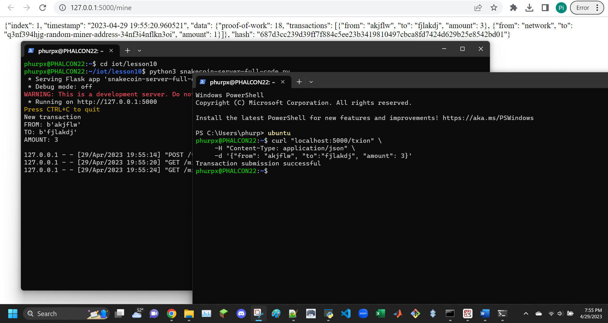
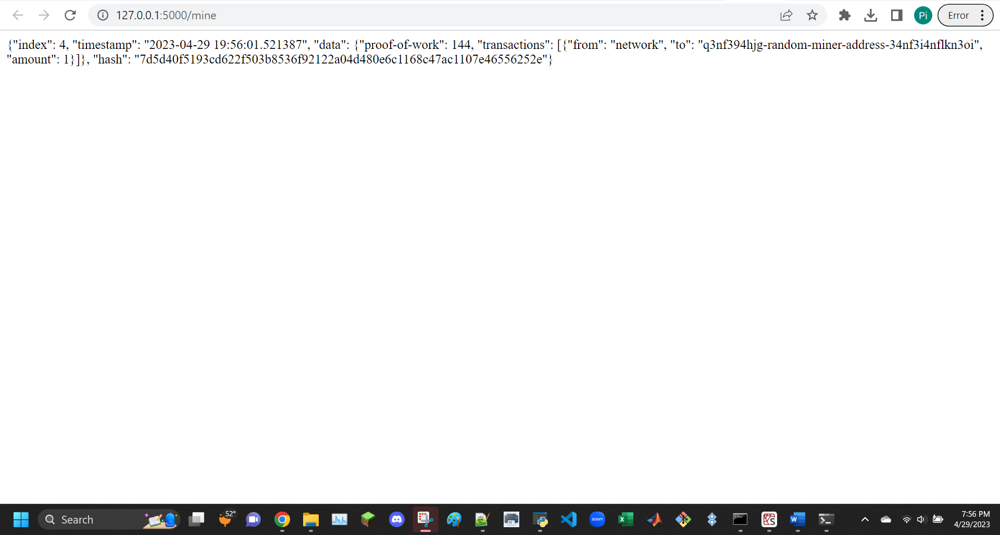
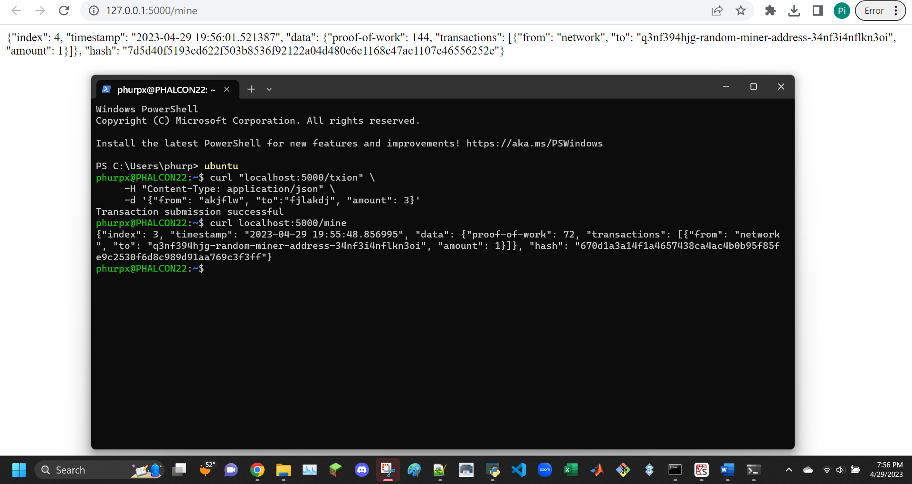
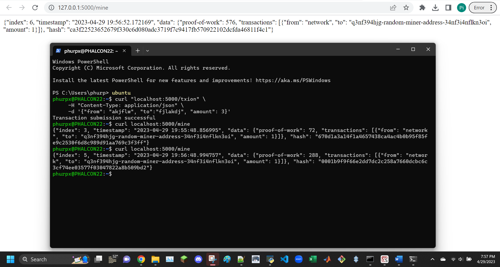
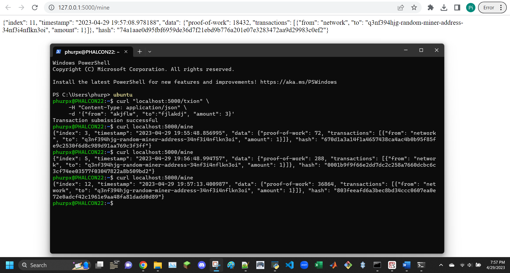
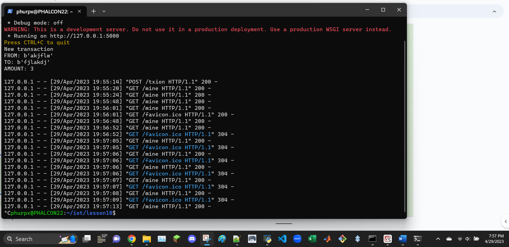

```
Uncomment the last line of node_server.py
```
```
$ git clone https://github.com/satwikkansal/python_blockchain_app.git
$ cd ~/python_blockchain_app
$ nano node_server.py
```
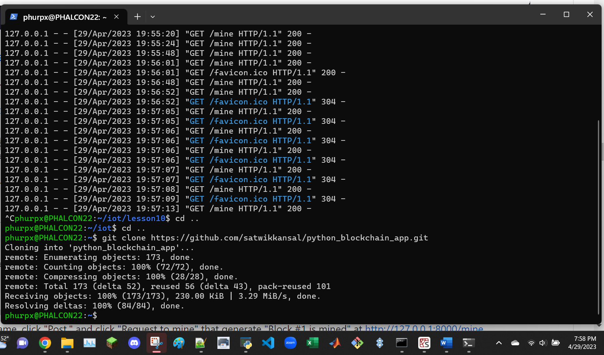
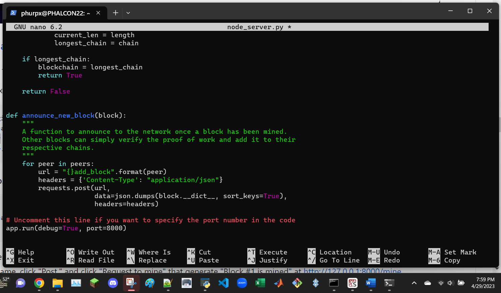
```
$ python3 node_server.py
```
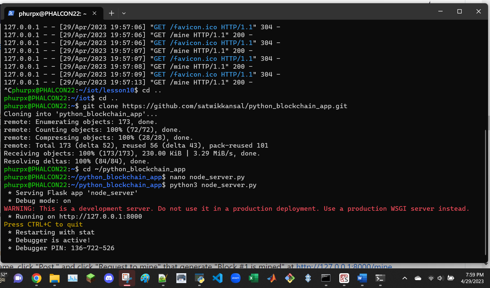

```
$ vncserver
$ cd ~/python_blockchain_app
$ python3 run_app.py
```
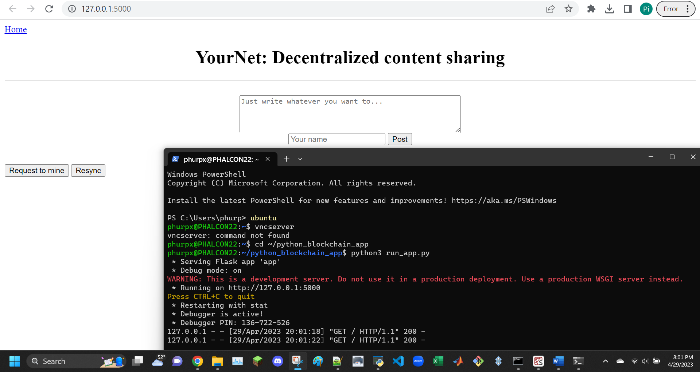

```
Via VNC viewer, open a browser on Raspberry Pi and go to YourNet running at http://127.0.0.1:5000/

Enter content and name, click "Post," and click "Request to mine" that generate "Block #1 is mined" at http://127.0.0.1:8000/mine

At YourNet, click "Resync" to view Block #1
```
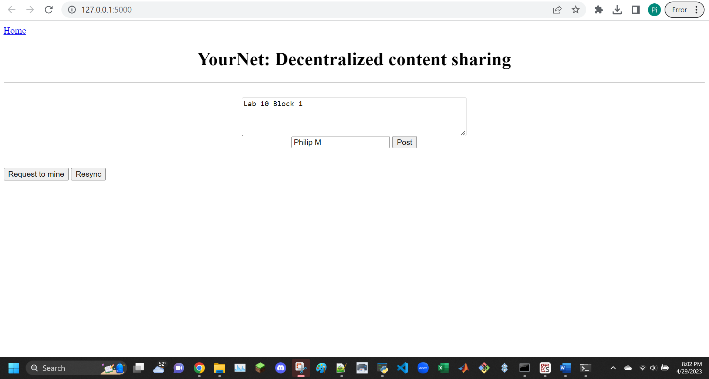
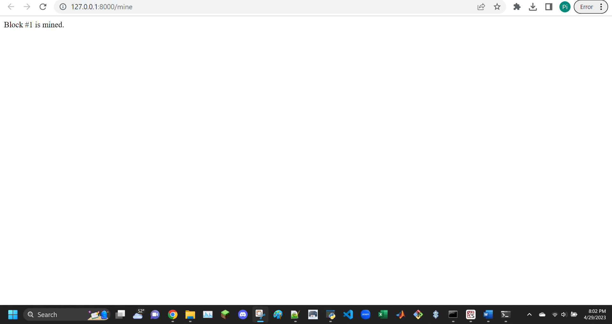
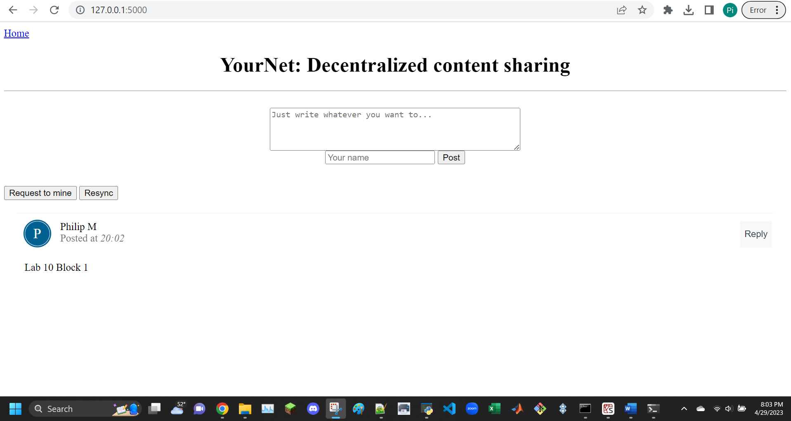
